# FlightNotify
Welcome to FlightNotify, a real-time flight status update service. FlightNotify provides users with timely notifications about their flights through email, SMS, and push notifications.
## Table of Contents

- [Introduction](#introduction)
- [Features](#features)
- [Technologies Used](#technologies-used)
- [Setup](#setup)
- [Block Diagram](#block-diagram)
- [System Workflow](#system-workflow)
- [Screenshots](#screenshots)

## Introduction

FlightNotify is designed to keep travelers informed about their flight status in real-time. Whether you're at the airport or on the go, you can receive updates on delays, gate changes, cancellations, and more through your preferred communication channel.

## Features

- **Real-Time Updates:** Get instant alerts about flight status changes.
- **Multiple Notification Channels:** Choose to receive updates via email, SMS, or push notifications.
- **Customizable Alerts:** Filter notifications to include only the information you need.
- **User-Friendly Interface:** Easy to navigate and manage your flight alerts.

## Technologies Used

FlightNotify is built using a combination of modern technologies to ensure reliability, scalability, maintainability and ease of use.

- **Backend:**
  - **Python:** Core programming language for the backend.
  - **Flask:** Micro web framework for building the API. Port=5000 and 5050
  - **Kafka:** Distributed event streaming platform for real-time data processing. Port=9092

- **Frontend:**
  - **React:** JavaScript library for building user interfaces. Port5173
  - **HTML:** Standard markup language used for creating and structuring content on the web.
  - **Tailwind CSS:** CSS framework for responsive design.

- **Notifications:**
  - **Twilio:** API service for sending SMS notifications.
  - **SMTPlib:** Library for sending email notifications.
  - **Web Push API:** Allows web applications to receive and send push notifications from a server, enabling real-time updates and interactions even when the application is not active in the browser.

- **Database:**
  - **MongoDB:** NoSQL Database to store user, ticket and flight related data.

### Packages with versions
#### Python
```python
Package            Version
------------------ --------
Flask              3.0.3
Flask-Cors         4.0.1
kafka-python       2.0.2
pip                24.1.2
py-vapid           1.9.1
PyJWT              2.8.0
pymongo            4.8.0
python-dotenv      1.0.1
pywebpush          2.0.0
requests           2.32.3
twilio             9.2.3
```
## Setup
### 1. .env File in server directory
```
# SMS Server
TWILIO_ACCOUNT_SID=<account_sid>
TWILIO_AUTH_TOKEN=<auth_token>
TWILIO_NUMBER=<generated_phone_number>

# Email Server SMTP
EMAIL_SENDER=<your_email_address>
EMAIL_PASSWORD=<google_app_password>

# MongoDB 
MOONGODB_CONNECTION_STRING=<MongoDB_connection_string>

# Web push VAPid keys
VAPID_PUBLIC_KEY=<vapid_public_key>
VAPID_PRIVATE_KEY=<vapid_private_key>
VAPID_CLAIM_EMAIL=<vapid_claim_email>
```
### 2. .env File in client directory
```
# Web push VAPid keys
VAPID_PUBLIC_KEY=<vapid_public_key>
```
### 3. Send flight update to 
```js
POST http://127.0.0.1:5000/api/flight-update
body: {
    "flight_number" : "BA202",
    "status" : "Gate-Change",
    "departure_time" : "2023-07-25T09:30:00.000+0000",
    "arrival_time" : "2023-07-25T13:30:00.000+0000",
    "gate" : "C3",
    "departure_airport" : "DEL",
    "arrival_airport" : "CCU"
}
```
## Block Diagram
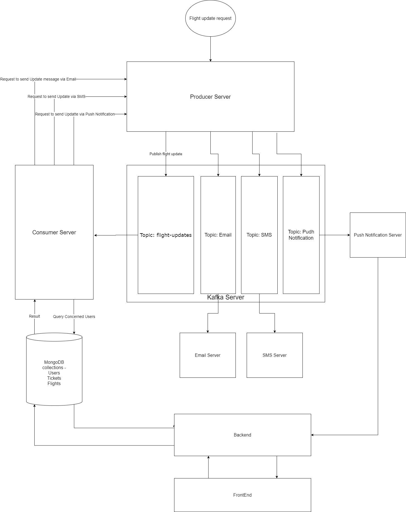

## System Workflow
- **Simulating Flight Updates:**
    - The airport announces a flight update by sending a request to the producer server.
    - The producer server publishes the flight update to the flight-update topic in Kafka.

- **Consuming Flight Updates:**
    - A consumer reads the update from the flight-update topic.
    - The consumer queries the concerned passengers for the current update.
    - The consumer bundles the recipient data with the flight update message.
    - The consumer sends this bundled information to the producer server.
    
- **Publishing to Corresponding Topics:**
    - The producer publishes the bundled requests to the corresponding topics in Kafka (e.g., email requests to the email topic).

- **Delivering Updates:**
    - The respective servers (email-server, sms-server, push-notification-server) consume these messages.
    - Each server delivers the update via its respective medium.

## Screenshots
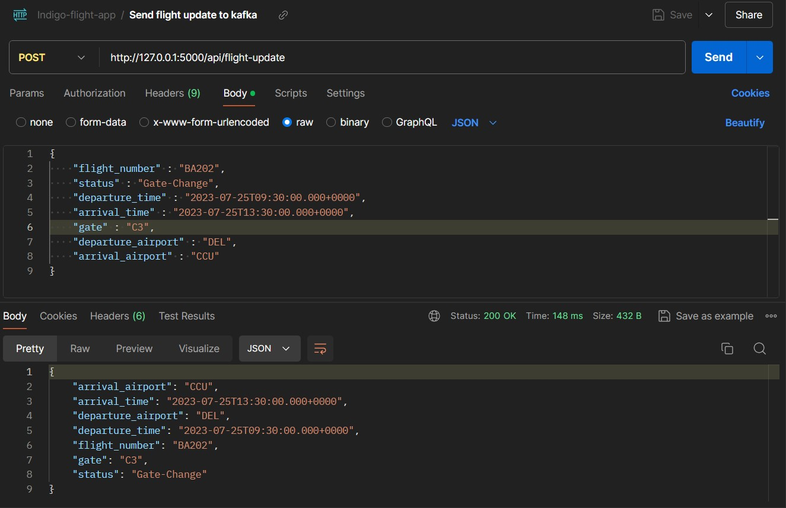
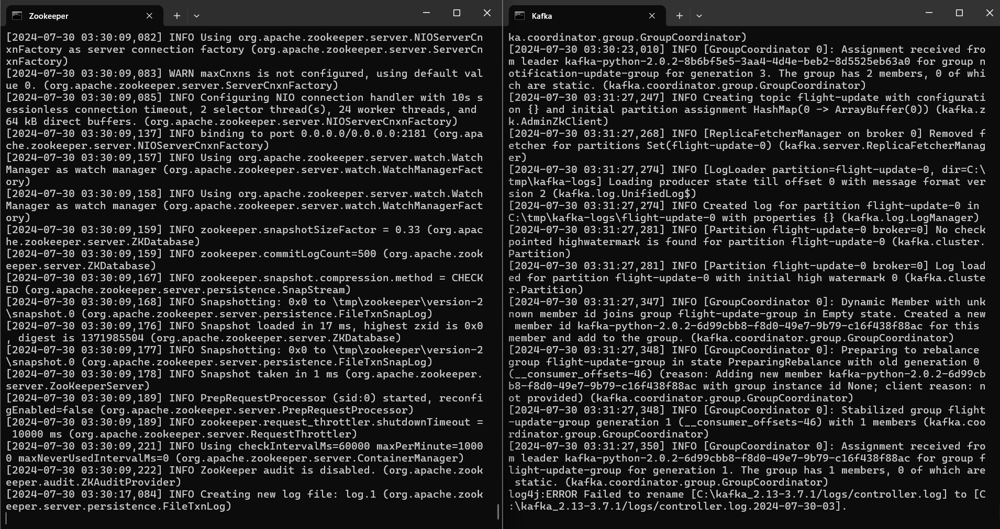
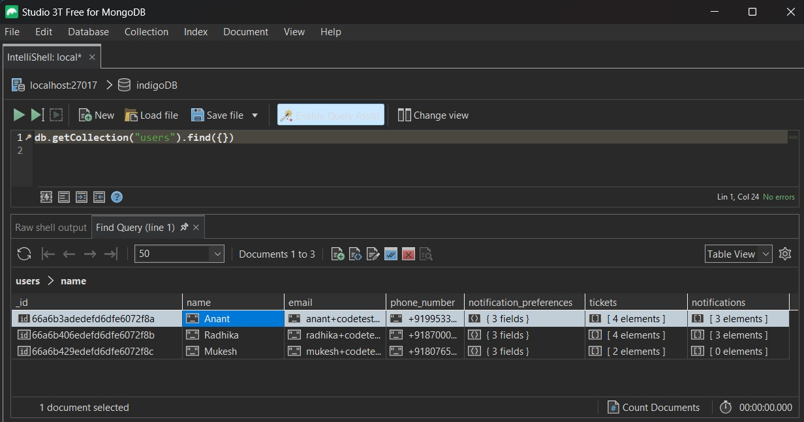
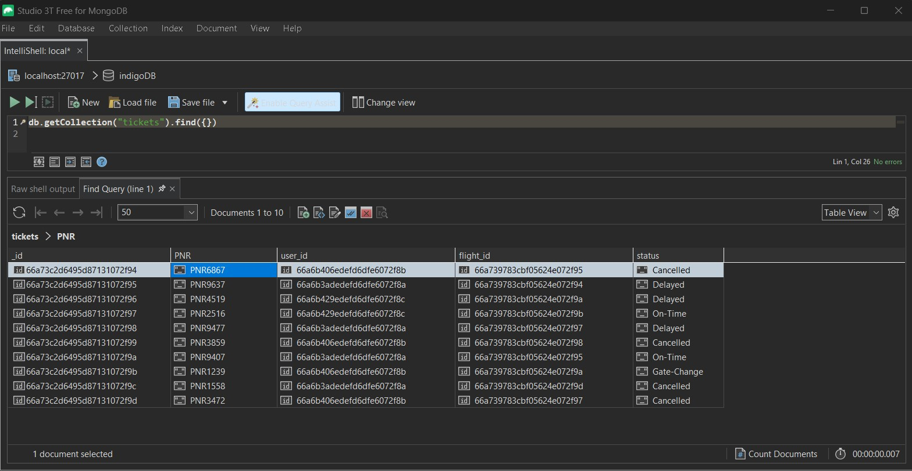
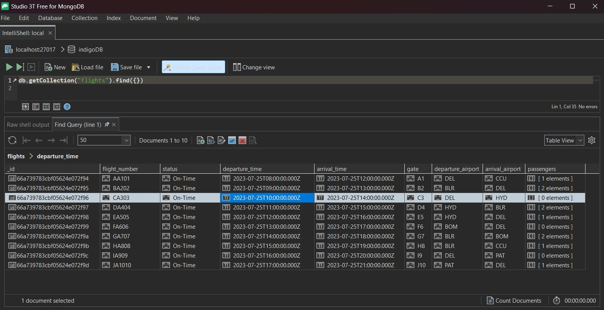
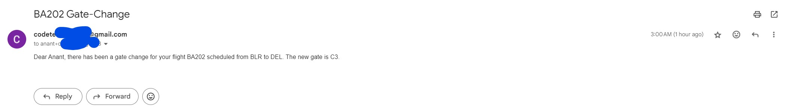
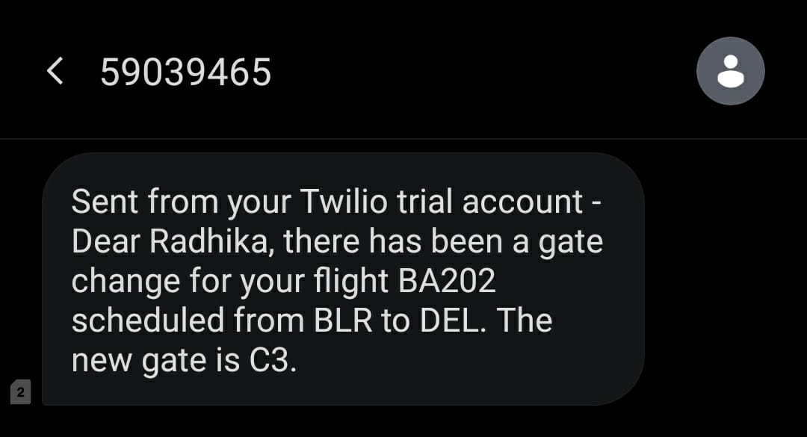
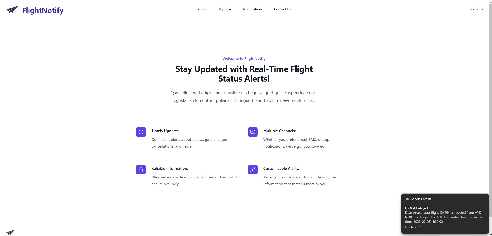
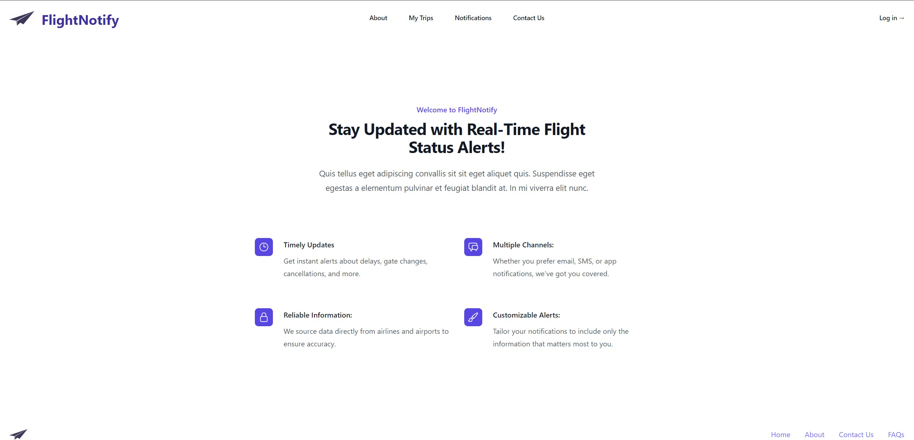
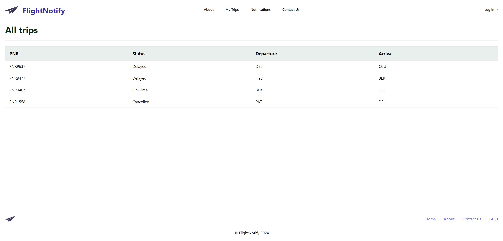

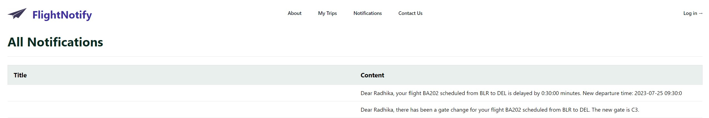
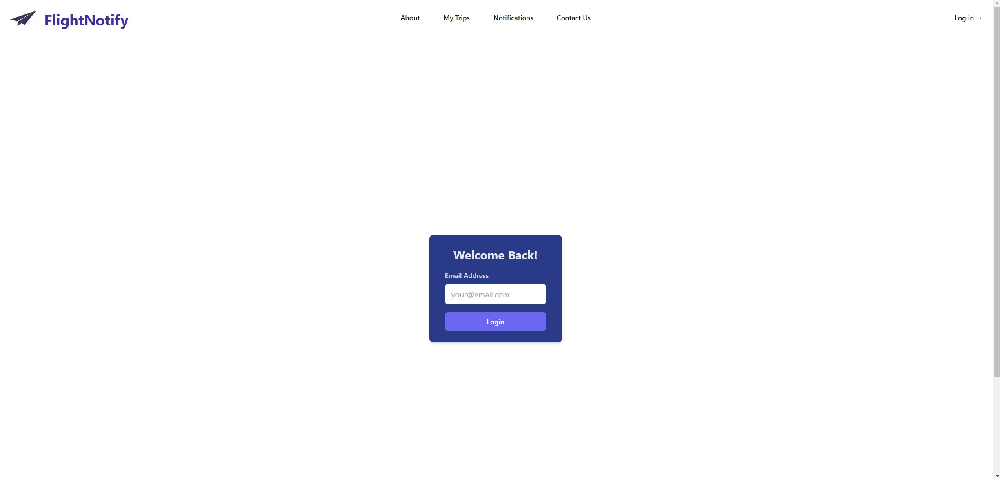